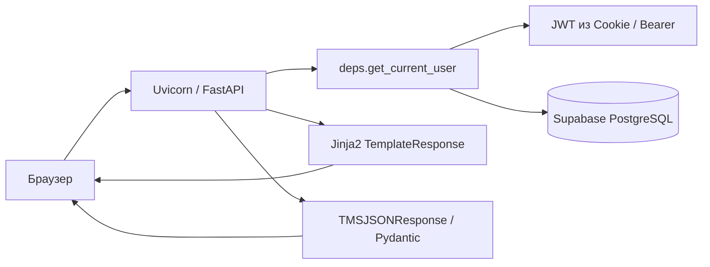

# Архитектура АИС TMS

## Обзор

**АИС TMS** (Tool Management System) — веб-приложение для учёта, выдачи и аналитики инструмента на предприятии ОАО «БААЗ». Система построена по классической схеме **Backend + BaaS Database + Server-Side Rendering**.

## Технологический стек

| Слой | Технология | Назначение |
|------|------------|------------|
| HTTP API | **FastAPI** | REST API, маршрутизация, валидация Pydantic |
| ASGI-сервер | **Uvicorn** | Запуск приложения в dev/production |
| БД | **Supabase (PostgreSQL)** | Хранение данных, триггеры, PostgREST API |
| Клиент БД | **supabase-py** | Синхронные запросы к PostgREST |
| UI | **Jinja2** | HTML-шаблоны, серверный рендеринг |
| Аутентификация | **JWT (python-jose)** + **HttpOnly Cookie** | Сессия пользователя без localStorage |
| Пароли | **passlib + bcrypt** | Хеширование учётных записей |
| Отчёты | **pandas**, **openpyxl**, **xlsxwriter**, **python-docx** | Excel и Word экспорт |

## Структура репозитория

```
baaz_tms/
├── main.py                 # Точка входа FastAPI, CORS, обработчики ошибок
├── schema.sql              # DDL, триггеры, начальные данные
├── requirements.txt        # Зависимости Python
├── .env.example            # Шаблон переменных окружения
├── app/
│   ├── api/
│   │   ├── deps.py         # JWT, роли, зависимости FastAPI
│   │   └── endpoints/      # Роутеры: auth, pages, admin, tools, …
│   ├── core/
│   │   ├── config.py       # Settings (Pydantic Settings)
│   │   ├── db_utils.py     # execute_supabase, маппинг ошибок БД
│   │   ├── helpers.py      # normalize_join, JSON-сериализация
│   │   ├── security.py     # JWT, bcrypt
│   │   └── supabase.py     # Фабрика клиента Supabase
│   └── models/
│       └── schemas.py      # Pydantic-модели, enum-ы домена
├── templates/              # Jinja2 HTML (base, inventory, analytics, …)
├── docs/                   # Проектная документация
└── scripts/                # Вспомогательные скрипты (seed, hash)
```

## Поток запроса



## Безопасность

### JWT в HttpOnly Cookie

1. Пользователь отправляет логин/пароль на `POST /api/v1/auth/login`.
2. Сервер проверяет `tms_users.password_hash` (bcrypt).
3. Выдаётся JWT с полями `sub` (UUID пользователя), `role`, опционально `warehouse_id`.
4. Токен записывается в cookie `tms_access_token`:
   - `HttpOnly` — недоступен из JavaScript (защита от XSS).
   - `SameSite=lax` — базовая защита от CSRF.
   - `Secure=false` в dev (в production — `true` за HTTPS).

### Авторизация по ролям

Зависимости в `app/api/deps.py`:

- `require_admin_only` — только `admin`
- `require_clerk_only` — только `clerk`
- `require_master_only` — только `master`
- `require_master_or_admin`, `require_clerk_or_master`, `require_report_access` — комбинированные

При `401` для HTML-запросов cookie очищается и выполняется редирект на `/login`.

### Интеграция CMMS

Эндпоинты `/api/v1/integration/*` защищены заголовками `Authorization: Bearer <TMS_INTEGRATION_SECRET>` и `apikey` (см. [integration.md](./integration.md)).

### Конфигурация

- Секреты хранятся в `.env` (не коммитится).
- Локальный `.env` имеет приоритет над системными переменными окружения (`app/core/config.py`).
- Supabase service role key используется только на сервере.

## JSON и UUID

- Pydantic-модели наследуют `TMSBaseModel`; ответы API сериализуются через `model_dump(mode="json")`.
- Глобальный `TMSJSONResponse` в `main.py` сериализует UUID и даты в строки.
- В Jinja2-шаблонах UUID передаются через фильтр `tojson`.

## Модули API

| Префикс | Файл | Назначение |
|---------|------|------------|
| `/api/v1/auth` | `auth.py` | Вход/выход |
| `/` | `pages.py` | HTML-страницы |
| `/api/v1/admin` | `admin.py` | Пользователи, структура (админ) |
| `/api/v1/master` | `master.py` | Справочники, структура (мастер) |
| `/api/v1/tools` | `tools.py` | CRUD инструментов, внутренняя выдача |
| `/api/v1/requisitions` | `requisitions.py` | CMMS/внутренние заявки |
| `/api/v1/analytics` | `analytics.py` | Аналитические JSON API |
| `/api/v1/reports` | `reports.py` | Excel/Word экспорт |
| `/api/v1/integration` | `integration.py` | Контуры А и Б с CMMS |
