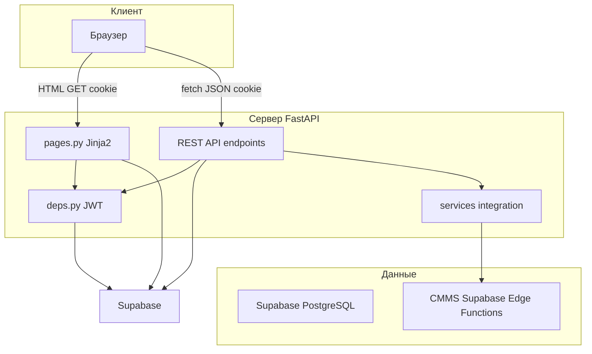

# Описание клиент-серверной архитектуры BAAZ TMS

## 1. Назначение системы

BAAZ Tool Tracker — веб-приложение учёта инструмента, выдачи и возврата, аналитики и обмена данными с системой CMMS. Архитектура построена по схеме трёхуровневого приложения: клиентский браузер, сервер приложений на FastAPI, база данных PostgreSQL в составе Supabase.

## 2. Технологический стек

| Слой | Технология | Назначение |
|------|------------|------------|
| HTTP-сервер и API | FastAPI | Маршрутизация, валидация запросов, REST API |
| ASGI-сервер | Uvicorn | Запуск и обслуживание HTTP-запросов |
| База данных | Supabase, PostgreSQL | Хранение данных, триггеры, ограничения целостности |
| Доступ к БД | supabase-py, PostgREST | Синхронные запросы сервера к таблицам |
| Представление | Jinja2 | Серверный рендеринг HTML-страниц |
| Стилизация | Bootstrap 5, пользовательский CSS | Адаптивная сетка и фирменное оформление БААЗ |
| Аутентификация | JWT, python-jose | Подпись и проверка токена сессии |
| Хранение сессии | HttpOnly Cookie | Передача JWT без доступа из JavaScript |
| Пароли | bcrypt | Хеширование учётных записей в таблице users |
| Интеграция CMMS | httpx | Исходящие HTTP-вызовы к Edge Functions CMMS |
| Отчёты | openpyxl, xlsxwriter, python-docx | Экспорт Excel и Word |

## 3. Логическая структура приложения

| Каталог | Содержание |
|---------|------------|
| main.py | Фабрика приложения create_app, регистрация роутеров, обработчики ошибок |
| app/api/endpoints/ | REST API и HTML-маршруты по доменам |
| app/api/deps.py | Извлечение JWT, загрузка пользователя, проверка ролей |
| app/core/ | Конфигурация, безопасность, клиент Supabase, утилиты БД |
| app/models/schemas.py | Pydantic-модели и перечисления домена |
| app/services/ | Бизнес-логика интеграции CMMS |
| app/integration/ | HTTP-клиент CMMS, режимы Mock и Live |
| templates/ | HTML-шаблоны Jinja2 |
| supabase/migrations/ | Миграции схемы PostgreSQL |

## 4. Компоненты и их взаимодействие

### 4.1. Клиент

Клиент — браузер пользователя. Взаимодействие выполняется двумя способами:

1. **Полная загрузка HTML-страниц** — GET-запросы к маршрутам pages.py. Сервер возвращает готовый HTML с данными, встроенными в шаблон Jinja2.
2. **Частичное обновление через JavaScript** — fetch к JSON API с передачей cookie сессии. Используется на страницах аналитики, инвентаря, заявок.

Клиент не обращается к Supabase напрямую. Все операции с данными проходят через FastAPI.

### 4.2. Сервер приложений

FastAPI принимает HTTP-запрос, выполняет цепочку обработки:

1. Middleware CORS при необходимости кросс-доменных запросов.
2. Зависимость get_current_user или require_roles для защищённых маршрутов.
3. Валидация тела запроса через Pydantic-модели.
4. Вызов supabase-py для чтения или записи в PostgreSQL.
5. Формирование ответа: TemplateResponse для HTML или TMSJSONResponse для JSON.

Обработчики ошибок в main.py преобразуют HTTP 401 и 403 для HTML-запросов в редирект на страницу входа.

### 4.3. База данных

PostgreSQL размещён в Supabase. Сервер использует ключ service_role и обходит PostgREST с полными правами на таблицы public. Политики Row Level Security не применяются: разграничение доступа реализовано на уровне FastAPI по полю role пользователя.

Доменная логика частично перенесена в триггеры PostgreSQL: лимит выдачи, проверка доступности инструмента, автоматическое назначение статуса обслуживания при возврате.

## 5. Механизм аутентификации и сессии

### 5.1. Вход в систему

| Шаг | Действие |
|-----|----------|
| 1 | Пользователь отправляет логин и пароль на POST /api/v1/auth/login |
| 2 | Сервер ищет запись в таблице users по полю login |
| 3 | Пароль сверяется с password_hash через bcrypt |
| 4 | Формируется JWT с полями sub, role, warehouse_id, exp |
| 5 | Токен записывается в cookie tms_access_token |
| 6 | Выполняется редирект на главную страницу |

Альтернативный вход: POST /api/v1/auth/login/json возвращает JSON и также устанавливает cookie.

### 5.2. Параметры cookie

| Параметр | Значение | Назначение |
|----------|----------|------------|
| HttpOnly | true | Защита от кражи токена через XSS |
| SameSite | lax | Ограничение передачи cookie при межсайтовых запросах |
| Secure | true в production | Передача только по HTTPS |
| Path | / | Доступность cookie для всего приложения |
| Max-Age | срок из JWT_ACCESS_TOKEN_EXPIRE_MINUTES | Автоматическое истечение сессии |

### 5.3. Проверка запроса

При каждом защищённом запросе deps.get_current_user:

1. Извлекает JWT из заголовка Authorization Bearer или из cookie tms_access_token.
2. Декодирует и проверяет подпись через JWT_SECRET_KEY.
3. Загружает актуальную запись пользователя из таблицы users по UUID из поля sub.
4. Возвращает объект CurrentUser с полями id, login, role, warehouse_id, employee_full_name.

При отсутствии или недействительности токена возвращается HTTP 401. Cookie очищается.

### 5.4. Авторизация по ролям

| Роль | Основные разделы |
|------|------------------|
| admin | Пользователи, структура предприятия, просмотр инвентаря, аналитика |
| master | Каталог инструмента, инвентарь, аналитика, отправка в CMMS |
| clerk | Инвентарь своего склада, заявки на выдачу, отправка в CMMS |

Зависимости require_roles, require_admin_only, require_master_or_admin и другие подключаются к эндпоинтам явно.

## 6. Потоки передачи данных

### 6.1. Серверный рендеринг HTML

```
Браузер → GET /inventory → FastAPI pages.py
       → get_current_user → Supabase SELECT tools
       → Jinja2 inventory.html → HTML-ответ → Браузер
```

Данные передаются в шаблон как контекст Python-словаря. UUID сериализуются в строки через фильтр tojson. Статусы отображаются через фильтры tool_status_label и requisition_status_label.

### 6.2. JSON API

```
Браузер → fetch /api/v1/analytics/tool-stats + cookie
       → FastAPI analytics.py → require_master_or_admin
       → Supabase SELECT → Pydantic ToolStatsResponse
       → TMSJSONResponse → JSON → Браузер → Chart.js
```

Класс TMSJSONResponse в main.py обеспечивает сериализацию UUID и дат в ISO-строки. Клиентский JavaScript обрабатывает ответ без дополнительного преобразования идентификаторов.

### 6.3. Интеграционный контур CMMS → TMS

```
CMMS → POST /api/v1/integration/cmms/tool-requisitions
     → Bearer TMS_INTEGRATION_SECRET
     → CmmsIntegrationService → INSERT requisitions
     → JSON CreateToolRequisitionResponse → CMMS
```

Подробности описаны в документе integration_contracts.md.

### 6.4. Интеграционный контур TMS → CMMS

```
Браузер → POST /api/v1/tools/{id}/send-to-cmms + cookie JWT
       → tools.py → CmmsRepairClient POST Edge Function CMMS
       → INSERT cmms_repair_links → обновление tools.status
       → JSON-ответ → UI инвентаря
```

## 7. Сериализация типов данных

| Тип | Обработка на сервере | Формат в JSON и HTML |
|-----|----------------------|----------------------|
| UUID | str в PostgREST, UUID в Pydantic | Строка формата xxxxxxxx-xxxx-xxxx-xxxx-xxxxxxxxxxxx |
| date | date в Pydantic | Строка YYYY-MM-DD |
| datetime | datetime в Pydantic | Строка ISO 8601 с часовым поясом |
| JSONB | dict в Python через specs | Объект JSON в API при необходимости |

## 8. Регистрация модулей API

| Префикс | Модуль | Назначение |
|---------|--------|------------|
| /api/v1/auth | auth.py | Вход, выход |
| / | pages.py | HTML-страницы |
| /api/v1/admin | admin.py | Администрирование |
| /api/v1/master | master.py | Справочники и структура |
| /api/v1/tools | tools.py | Инвентарь и операции с инструментом |
| /api/v1/requisitions | requisitions.py | Заявки на выдачу |
| /api/v1/analytics | analytics.py | Аналитические данные |
| /api/v1/reports | reports.py | Экспорт отчётов |
| /api/v1/integration/cmms | integration_cmms.py | Входящая интеграция CMMS |

## 9. Особенности развёртывания

- Локальная Supabase TMS работает на порту 55321.
- Конфигурация загружается из файла .env через pydantic-settings.
- Режим CMMS_INTEGRATION_MODE определяет использование Mock-фикстур или Live HTTP.
- Приложение работает только в онлайн-режиме: недоступность Supabase приводит к ошибкам API и страниц.

## 10. Диаграмма архитектуры


