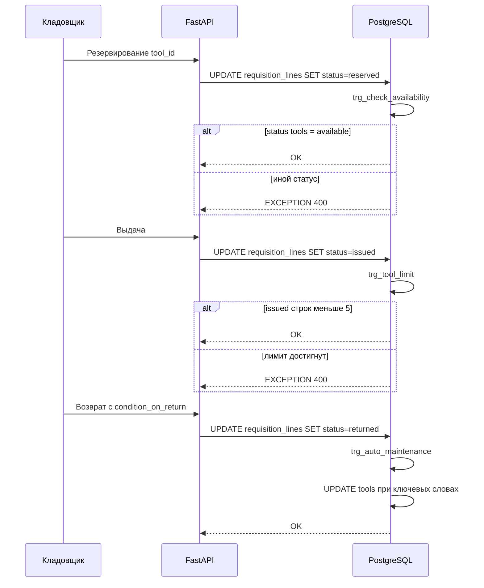

# Описание триггеров доменной логики BAAZ TMS

## 1. Общие сведения

Доменная логика выдачи и возврата инструмента частично реализована на уровне PostgreSQL в файле миграции supabase/migrations/030_triggers.sql. Триггеры срабатывают при изменении строк таблицы requisition_lines и гарантируют соблюдение бизнес-правил независимо от точки вызова — веб-интерфейс кладовщика или интеграционный API.

Ошибки триггеров возвращаются как исключения PostgreSQL с кодом P0001. Клиент supabase-py получает их через PostgREST, а функция execute_supabase в app/core/db_utils.py преобразует в HTTP 400 Bad Request с текстом сообщения на русском языке.

---

## 2. Триггер trg_tool_limit

### 2.1. Назначение

Ограничивает количество одновременно выданных инструментов в рамках одной заявки requisitions. Максимум — пять строк со статусом issued.

### 2.2. Функция

Имя функции: check_tool_limit

### 2.3. Условие срабатывания

| Параметр | Значение |
|----------|----------|
| Момент | BEFORE UPDATE |
| Таблица | requisition_lines |
| Гранулярность | FOR EACH ROW |
| Условие WHEN | new.status = issued AND old.status ≠ issued |

Триггер срабатывает только при первом переводе строки в статус issued. Повторные обновления уже выданной строки условие не активируют.

### 2.4. Алгоритм

1. Подсчитывается количество строк requisition_lines с requisition_id равным new.requisition_id и status равным issued.
2. Если количество больше или равно пяти, выполнение прерывается.
3. Иначе изменение строки разрешается.

### 2.5. Возвращаемая ошибка

| Элемент | Значение |
|---------|----------|
| Тип | RAISE EXCEPTION |
| Текст | Превышен лимит выдачи: один сотрудник не может иметь более 5 активных инструментов |
| HTTP при обработке через FastAPI | 400 Bad Request |

### 2.6. Бизнес-смысл

Правило моделирует ограничение предприятия на количество инструмента, одновременно находящегося у одного исполнителя по одной заявке CMMS или внутренней заявке.

---

## 3. Триггер trg_check_availability

### 3.1. Назначение

Запрещает резервирование инструмента, если экземпляр tools не находится в статусе available.

### 3.2. Функция

Имя функции: check_tool_availability

### 3.3. Условие срабатывания

| Параметр | Значение |
|----------|----------|
| Момент | BEFORE UPDATE |
| Таблица | requisition_lines |
| Гранулярность | FOR EACH ROW |
| Условие WHEN | new.status = reserved |

Триггер активируется при переводе строки заявки в статус reserved, когда кладовщик подбирает конкретный экземпляр tool_id.

### 3.4. Алгоритм

1. Из таблицы tools выбирается поле status для идентификатора new.tool_id.
2. Если status не равен available, выполнение прерывается.
3. В сообщение об ошибке подставляется фактический статус инструмента.
4. Если status равен available, изменение строки разрешается.

### 3.5. Возвращаемая ошибка

| Элемент | Значение |
|---------|----------|
| Тип | RAISE EXCEPTION |
| Шаблон текста | Невозможно выдать инструмент: текущий статус — %s |
| Подставляемое значение | Фактический status из таблицы tools |
| Пример текста | Невозможно выдать инструмент: текущий статус — in_use |
| HTTP при обработке через FastAPI | 400 Bad Request |

### 3.6. Бизнес-смысл

Правило обеспечивает выдачу только исправного и свободного экземпляра. Инструмент в статусах in_use, maintenance, pending_repair, pending_return или scrapped не может быть зарезервирован.

---

## 4. Триггер trg_auto_maintenance

### 4.1. Назначение

Автоматически переводит экземпляр tools в статус maintenance при возврате инструмента, если в поле condition_on_return указаны признаки неисправности.

### 4.2. Функция

Имя функции: auto_maintenance_status

### 4.3. Условие срабатывания

| Параметр | Значение |
|----------|----------|
| Момент | AFTER UPDATE |
| Таблица | requisition_lines |
| Гранулярность | FOR EACH ROW |
| Условие WHEN | new.status = returned AND new.condition_on_return IS NOT NULL |

Триггер срабатывает после фиксации возврата, когда кладовщик заполнил описание состояния инструмента.

### 4.4. Алгоритм

1. Текст condition_on_return приводится к проверке без учёта регистра через ILIKE.
2. Если текст содержит подстроку заточ, ремонт или сломан, выполняется UPDATE таблицы tools.
3. Поле status экземпляра new.tool_id устанавливается в maintenance.
4. Если ключевые слова не найдены, статус tools не изменяется.
5. Функция возвращает NEW без генерации исключения.

### 4.5. Ключевые слова для перевода в maintenance

| Подстрока в condition_on_return | Регистр |
|---------------------------------|---------|
| заточ | Не учитывается |
| ремонт | Не учитывается |
| сломан | Не учитывается |

### 4.6. Возвращаемые ошибки

Триггер не генерирует исключений. Ошибки возможны только при нарушении внешних ограничений, например при отсутствии tool_id, и обрабатываются стандартными кодами PostgreSQL.

### 4.7. Бизнес-смысл

Правило автоматизирует маркировку инструмента, требующего обслуживания, без отдельного действия кладовщика. После срабатывания экземпляр недоступен для новой выдачи до перевода в available мастером или завершения цикла CMMS.

---

## 5. Сводная таблица триггеров

| Триггер | Функция | Событие | Условие статуса строки | Действие при успехе | Ошибка |
|---------|---------|---------|------------------------|---------------------|--------|
| trg_tool_limit | check_tool_limit | BEFORE UPDATE | Переход в issued | Разрешить UPDATE | Лимит 5 единиц |
| trg_check_availability | check_tool_availability | BEFORE UPDATE | status = reserved | Разрешить UPDATE | Статус tools ≠ available |
| trg_auto_maintenance | auto_maintenance_status | AFTER UPDATE | status = returned и заполнено condition_on_return | UPDATE tools.status = maintenance | Нет |

---

## 6. Последовательность при типовой выдаче и возврате

---

## 7. Связь с прикладным слоем

FastAPI не дублирует логику триггеров. Эндпоинты requisitions.py и tools.py выполняют UPDATE requisition_lines и полагаются на ответ PostgreSQL. При срабатывании RAISE EXCEPTION пользователь получает сообщение из поля detail JSON-ответа или alert в браузере.

Агрегированный статус заявки requisitions.status вычисляется функцией derive_requisition_status в app/core/requisition_status.py на основе статусов строк и не управляется триггерами напрямую.
