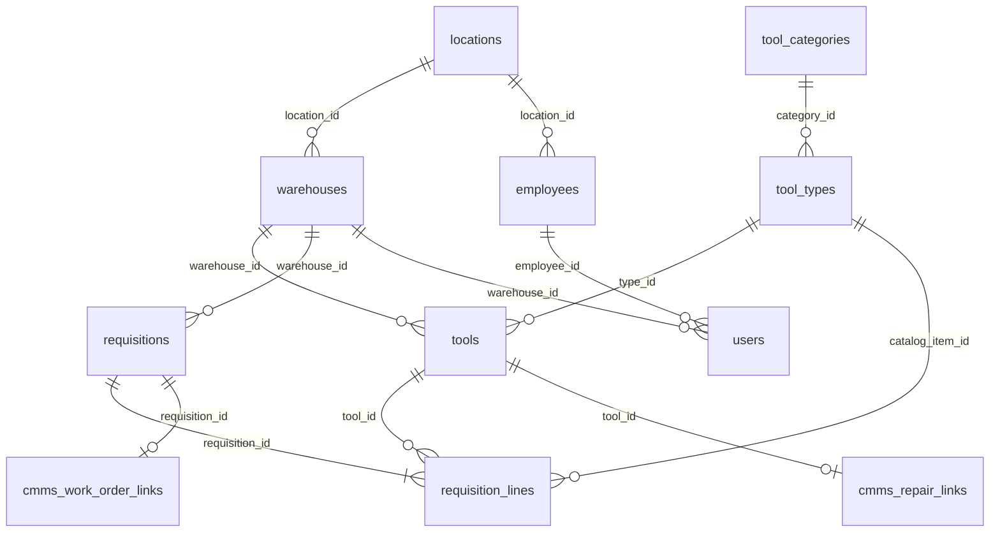

# База данных АИС TMS

Схема разбита на тематические миграции в `supabase/migrations/` и разворачивается в Supabase (PostgreSQL). Основные таблицы без префикса `tms_`; интеграция с CMMS вынесена в `cmms_*`.

## ER-диаграмма (упрощённая)



## Таблицы

### Справочники организации

| Таблица | Ключевые поля | Описание |
|---------|---------------|----------|
| `locations` | `id`, `name` | Цеха, участки, отделы |
| `warehouses` | `id`, `name`, `location_id` | Склады инструмента (ИРК) |
| `employees` | `id`, `badge_number`, `full_name`, `gender`, `birth_date`, `location_id` | Сотрудники для выдачи и отчётов |

### Номенклатура и экземпляры

| Таблица | Ключевые поля | Описание |
|---------|---------------|----------|
| `tool_categories` | `id`, `name` | Категории (режущий, мерительный, …) |
| `tool_types` | `id`, `model_name`, `category_id`, `specs`, `min_stock` | Типы/модели инструмента |
| `tools` | `id`, `type_id`, `warehouse_id`, `inventory_number`, `serial_number`, `status`, `wear_count`, `last_check` | Конкретные экземпляры |

**Статусы инструмента** (`tools.status`): `available`, `in_use`, `maintenance`, `scrapped`.

### Заявки

| Таблица | Ключевые поля | Описание |
|---------|---------------|----------|
| `requisitions` | `id`, `client_reference_id`, `warehouse_id`, `status`, `cancelled_at`, `cancel_reason` | Заголовок заявки (CMMS или внутренняя) |
| `requisition_lines` | `id`, `requisition_id`, `line_client_id`, `kind`, `catalog_item_id`, `description`, `quantity`, `tool_id`, `status`, `condition_on_return` | Строки заявки |

**Тип строки** (`requisition_lines.kind`): `catalog` (номенклатура из каталога) или `free_text` (свободное описание).

### Пользователи

| Таблица | Ключевые поля | Описание |
|---------|---------------|----------|
| `users` | `id`, `login`, `password_hash`, `role`, `employee_id`, `warehouse_id` | Учётные записи TMS |

**Роли**: `admin`, `clerk`, `master`.

### Интеграция CMMS

| Таблица | Ключевые поля | Описание |
|---------|---------------|----------|
| `cmms_work_order_links` | `requisition_id` (PK), `work_order_kind`, `cmms_work_order_number`, `cmms_work_order_status`, `technician_badge`, `technician_name`, `cancelled_by`, `cancel_reason_text`, `last_synced_at` | Связь заявки TMS с нарядом CMMS |
| `cmms_repair_links` | `id`, `tool_id` (unique), `cmms_request_id`, `cmms_request_number`, `client_reference_id` (unique) | Связь инструмента с заявкой на ремонт в CMMS |

**Вид наряда** (`cmms_work_order_kind`): `request`, `schedule`.

## Триггеры PostgreSQL

### 1. `trg_tool_limit` — лимит 5 инструментов на заявку

- **Функция**: `check_tool_limit()`
- **Событие**: `BEFORE UPDATE ON requisition_lines`
- **Условие**: переход строки в статус `issued`
- **Логика**: если в заявке уже ≥ 5 строк со статусом `issued`, выбрасывается исключение с текстом о превышении лимита.

### 2. `trg_auto_maintenance` — авто-перевод в ремонт

- **Функция**: `auto_maintenance_status()`
- **Событие**: `AFTER UPDATE ON requisition_lines`
- **Условие**: статус `returned` и заполнено `condition_on_return`
- **Логика**: если комментарий содержит «заточ», «ремонт» или «сломан» (ILIKE), инструмент переводится в `maintenance`.

### 3. `trg_check_availability` — запрет выдачи неисправного

- **Функция**: `check_tool_availability()`
- **Событие**: `BEFORE UPDATE ON requisition_lines`
- **Условие**: переход в статус `reserved`
- **Логика**: если `tools.status != 'available'`, выдача блокируется.

### 4. `trg_sync_cmms_work_order_status` — синхронизация статуса наряда CMMS

- **Функция**: `sync_cmms_work_order_status()`
- **Событие**: `AFTER INSERT OR UPDATE OF status ON requisitions`
- **Логика**: обновляет `cmms_work_order_links.cmms_work_order_status` и `last_synced_at` для связанной заявки.

## Аналитические запросы (Supabase / PostgREST)

Логика реализована в `app/api/endpoints/analytics.py`. Ниже — эквивалентная SQL-семантика.

### Пенсионеры (`GET /api/v1/analytics/pensioners`)

```sql
SELECT e.*, l.name AS location_name
FROM employees e
LEFT JOIN locations l ON l.id = e.location_id
WHERE e.gender = 'жен'
  AND e.birth_date IS NOT NULL
  AND e.birth_date <= :cutoff_date   -- 55 лет на текущую дату
ORDER BY l.name, e.full_name;
```

Дополнительная фильтрация по точному возрасту выполняется в Python (`_calc_age`).

### Статистика по категориям (`GET /api/v1/analytics/tool-stats`)

```sql
SELECT c.id, c.name, COUNT(t.id) AS tool_count
FROM tools t
JOIN tool_types tt ON tt.id = t.type_id
LEFT JOIN tool_categories c ON c.id = tt.category_id
GROUP BY c.id, c.name;
```

Агрегация и проценты считаются в приложении.

### Просроченная поверка (`GET /api/v1/analytics/overdue-calibration`)

```sql
SELECT t.*, tt.model_name, c.name AS category_name
FROM tools t
JOIN tool_types tt ON tt.id = t.type_id
LEFT JOIN tool_categories c ON c.id = tt.category_id
WHERE t.status != 'scrapped'
  AND t.last_check IS NOT NULL
  AND c.name ILIKE ANY(ARRAY['%мерит%', '%измер%']);
```

В Python: `next_due = last_check + 365 дней`; если `today > next_due` — инструмент просрочен.

### Молодой, но изношенный (`GET /api/v1/analytics/young-worn-tools`)

```sql
SELECT t.*, tt.model_name
FROM tools t
JOIN tool_types tt ON tt.id = t.type_id
WHERE t.wear_count > 50;
```

В Python отбрасываются записи, где с даты `last_check` прошло менее 365 дней.

## Ограничения и индексы

- `employees.badge_number` — UNIQUE
- `users.login` — UNIQUE
- `requisitions.client_reference_id` — UNIQUE (идемпотентность CMMS)
- `cmms_repair_links.tool_id` — UNIQUE
- `cmms_repair_links.client_reference_id` — UNIQUE
- CHECK на `tools.status`, `users.role`, `employees.gender`, `requisition_lines.kind`

## Начальные данные

`supabase/seed.sql` содержит seed: цеха, склады, сотрудники, категории, типы, экземпляры инструмента (демо-микрометр `d1000000-0000-4000-8000-000000000001`) и демо-учётные записи:

| Логин | Пароль | Роль | Склад / примечание |
|-------|--------|------|-------------------|
| `admin` | `admin123` | admin | без склада, Отдел ИТ |
| `clerk` | `clerk123` | clerk | ИРК-1 (`a1000000-0000-4000-8000-000000000001`) |
| `master` | `master123` | master | без склада, Инструментальный отдел |

Паттерн пароля: `{login}123`. Хэши в seed — bcrypt; пересоздать: `python create_hash.py`.
