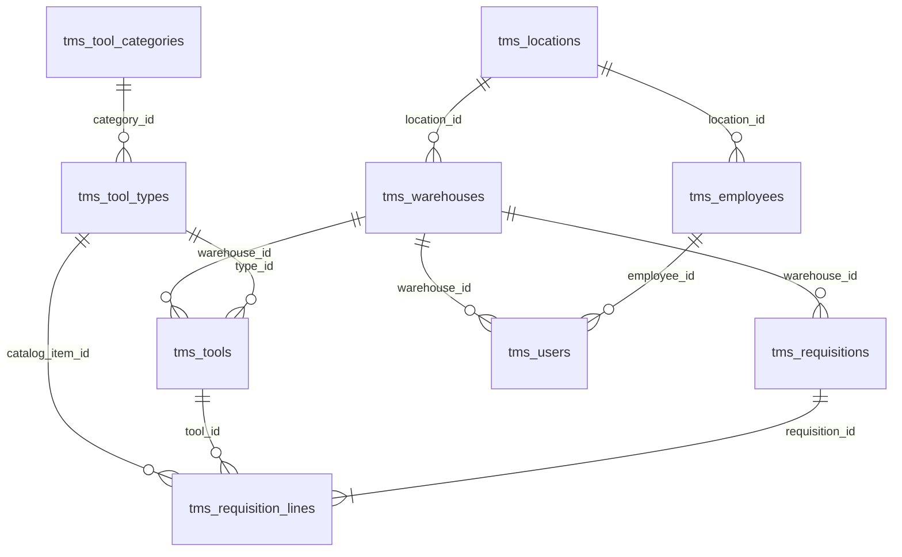

# База данных АИС TMS

Все таблицы используют префикс `tms_`. Схема определена в `schema.sql` и разворачивается в Supabase (PostgreSQL).

## ER-диаграмма (упрощённая)



## Таблицы

### Справочники организации

| Таблица | Ключевые поля | Описание |
|---------|---------------|----------|
| `tms_locations` | `id`, `name` | Цеха, участки, отделы |
| `tms_warehouses` | `id`, `name`, `location_id` | Склады инструмента (ИРК) |
| `tms_employees` | `id`, `badge_number`, `full_name`, `gender`, `birth_date`, `location_id` | Сотрудники для выдачи и отчётов |

### Номенклатура и экземпляры

| Таблица | Ключевые поля | Описание |
|---------|---------------|----------|
| `tms_tool_categories` | `id`, `name` | Категории (режущий, мерительный, …) |
| `tms_tool_types` | `id`, `model_name`, `category_id`, `specs`, `min_stock` | Типы/модели инструмента |
| `tms_tools` | `id`, `type_id`, `warehouse_id`, `inventory_number`, `serial_number`, `status`, `wear_count`, `last_check` | Конкретные экземпляры |

**Статусы инструмента** (`tms_tools.status`): `available`, `in_use`, `maintenance`, `scrapped`.

### Заявки (Контур Б)

| Таблица | Ключевые поля | Описание |
|---------|---------------|----------|
| `tms_requisitions` | `id`, `client_reference_id`, `warehouse_id`, `external_order_id`, `status`, `technician_name` | Заголовок заявки (CMMS или внутренняя) |
| `tms_requisition_lines` | `id`, `requisition_id`, `line_client_id`, `catalog_item_id`, `tool_id`, `status`, `condition_on_return` | Строки заявки |

### Пользователи

| Таблица | Ключевые поля | Описание |
|---------|---------------|----------|
| `tms_users` | `id`, `login`, `password_hash`, `role`, `employee_id`, `warehouse_id` | Учётные записи TMS |

**Роли**: `admin`, `clerk`, `master`.

## Триггеры PostgreSQL

### 1. `trg_tool_limit` — лимит 5 инструментов на заявку

- **Функция**: `tms_check_tool_limit()`
- **Событие**: `BEFORE UPDATE ON tms_requisition_lines`
- **Условие**: переход строки в статус `issued`
- **Логика**: если в заявке уже ≥ 5 строк со статусом `issued`, выбрасывается исключение с текстом о превышении лимита.

### 2. `trg_auto_maintenance` — авто-перевод в ремонт

- **Функция**: `tms_auto_maintenance_status()`
- **Событие**: `AFTER UPDATE ON tms_requisition_lines`
- **Условие**: статус `returned` и заполнено `condition_on_return`
- **Логика**: если комментарий содержит «заточ», «ремонт» или «сломан» (ILIKE), инструмент переводится в `maintenance`.

### 3. `trg_check_availability` — запрет выдачи неисправного

- **Функция**: `tms_check_tool_availability()`
- **Событие**: `BEFORE UPDATE ON tms_requisition_lines`
- **Условие**: переход в статус `reserved`
- **Логика**: если `tms_tools.status != 'available'`, выдача блокируется.

## Аналитические запросы (Supabase / PostgREST)

Логика реализована в `app/api/endpoints/analytics.py`. Ниже — эквивалентная SQL-семантика.

### Пенсионеры (`GET /api/v1/analytics/pensioners`)

```sql
SELECT e.*, l.name AS location_name
FROM tms_employees e
LEFT JOIN tms_locations l ON l.id = e.location_id
WHERE e.gender = 'жен'
  AND e.birth_date IS NOT NULL
  AND e.birth_date <= :cutoff_date   -- 55 лет на текущую дату
ORDER BY l.name, e.full_name;
```

Дополнительная фильтрация по точному возрасту выполняется в Python (`_calc_age`).

### Статистика по категориям (`GET /api/v1/analytics/tool-stats`)

```sql
SELECT c.id, c.name, COUNT(t.id) AS tool_count
FROM tms_tools t
JOIN tms_tool_types tt ON tt.id = t.type_id
LEFT JOIN tms_tool_categories c ON c.id = tt.category_id
GROUP BY c.id, c.name;
```

Агрегация и проценты считаются в приложении.

### Просроченная поверка (`GET /api/v1/analytics/overdue-calibration`)

```sql
SELECT t.*, tt.model_name, c.name AS category_name
FROM tms_tools t
JOIN tms_tool_types tt ON tt.id = t.type_id
LEFT JOIN tms_tool_categories c ON c.id = tt.category_id
WHERE t.status != 'scrapped'
  AND t.last_check IS NOT NULL
  AND c.name ILIKE ANY(ARRAY['%мерит%', '%измер%']);
```

В Python: `next_due = last_check + 365 дней`; если `today > next_due` — инструмент просрочен.

### Молодой, но изношенный (`GET /api/v1/analytics/young-worn-tools`)

```sql
SELECT t.*, tt.model_name
FROM tms_tools t
JOIN tms_tool_types tt ON tt.id = t.type_id
WHERE t.wear_count > 50;
```

В Python отбрасываются записи, где с даты `last_check` прошло менее 365 дней.

## Ограничения и индексы

- `tms_employees.badge_number` — UNIQUE
- `tms_users.login` — UNIQUE
- `tms_requisitions.client_reference_id` — UNIQUE (идемпотентность CMMS)
- CHECK на `tms_tools.status`, `tms_users.role`, `tms_employees.gender`

## Начальные данные

`schema.sql` содержит seed: цеха, склады, сотрудники, категории, типы, экземпляры инструмента и учётная запись `admin` (пароль задаётся через `create_hash.py`).
