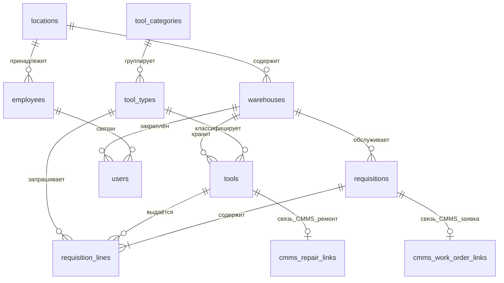

# Детальное описание схемы базы данных BAAZ TMS

## 1. Общие сведения

База данных размещена в Supabase и реализована на PostgreSQL. Схема public содержит справочники организации, номенклатуру инструмента, учётные записи, заявки на выдачу и таблицы связи с CMMS. Миграции хранятся в каталоге supabase/migrations.

Состояние схемы подтверждено через Supabase MCP: 11 таблиц в схеме public, Row Level Security отключён, контроль доступа выполняется на уровне приложения FastAPI.

## 2. Диаграмма связей основных таблиц

---

## 3. Таблица locations

### Назначение

Справочник подразделений и производственных площадок предприятия. Используется для группировки складов и привязки сотрудников к структурным единицам.

### Поля

| Поле | Тип PostgreSQL | Ограничения | Описание |
|------|----------------|-------------|----------|
| id | UUID | PRIMARY KEY, DEFAULT gen_random_uuid | Уникальный идентификатор подразделения |
| name | TEXT | NOT NULL | Наименование подразделения |

### Связи

| Тип связи | Локальное поле | Целевая таблица | Целевое поле |
|-----------|----------------|-----------------|--------------|
| Исходящая | id | warehouses | location_id |
| Исходящая | id | employees | location_id |

---

## 4. Таблица warehouses

### Назначение

Справочник складов инструмента. Каждый склад может быть привязан к подразделению. Склад определяет зону ответственности кладовщика и фильтрацию данных в интерфейсе.

### Поля

| Поле | Тип PostgreSQL | Ограничения | Описание |
|------|----------------|-------------|----------|
| id | UUID | PRIMARY KEY, DEFAULT gen_random_uuid | Уникальный идентификатор склада |
| name | TEXT | NOT NULL | Наименование склада |
| location_id | UUID | FOREIGN KEY → locations.id, NULL | Подразделение склада |

### Связи

| Тип связи | Локальное поле | Целевая таблица | Целевое поле |
|-----------|----------------|-----------------|--------------|
| Входящая | location_id | locations | id |
| Исходящая | id | tools | warehouse_id |
| Исходящая | id | users | warehouse_id |
| Исходящая | id | requisitions | warehouse_id |

---

## 5. Таблица employees

### Назначение

Справочник сотрудников предприятия. Хранит табельные данные для привязки учётных записей TMS и формирования кадровой аналитики.

### Поля

| Поле | Тип PostgreSQL | Ограничения | Описание |
|------|----------------|-------------|----------|
| id | UUID | PRIMARY KEY, DEFAULT gen_random_uuid | Уникальный идентификатор сотрудника |
| badge_number | TEXT | NOT NULL, UNIQUE | Табельный номер |
| full_name | TEXT | NOT NULL | ФИО сотрудника |
| gender | TEXT | CHECK: муж или жен | Пол |
| birth_date | DATE | NULL | Дата рождения |
| hire_date | DATE | DEFAULT CURRENT_DATE | Дата приёма на работу |
| location_id | UUID | FOREIGN KEY → locations.id, NULL | Подразделение сотрудника |

### Связи

| Тип связи | Локальное поле | Целевая таблица | Целевое поле |
|-----------|----------------|-----------------|--------------|
| Входящая | location_id | locations | id |
| Исходящая | id | users | employee_id |

---

## 6. Таблица users

### Назначение

Учётные записи пользователей TMS. Аутентификация выполняется по login и password_hash. Роль определяет доступ к функциям системы. Поле warehouse_id задаёт склад для роли clerk.

### Поля

| Поле | Тип PostgreSQL | Ограничения | Описание |
|------|----------------|-------------|----------|
| id | UUID | PRIMARY KEY, DEFAULT gen_random_uuid | Уникальный идентификатор пользователя |
| employee_id | UUID | FOREIGN KEY → employees.id, NULL | Связанный сотрудник |
| warehouse_id | UUID | FOREIGN KEY → warehouses.id, NULL | Склад кладовщика |
| login | TEXT | NOT NULL, UNIQUE | Логин для входа |
| password_hash | TEXT | NOT NULL | Bcrypt-хеш пароля |
| role | TEXT | NOT NULL, CHECK: admin, clerk, master | Роль пользователя |
| created_at | TIMESTAMPTZ | DEFAULT now | Дата создания записи |

### Связи

| Тип связи | Локальное поле | Целевая таблица | Целевое поле |
|-----------|----------------|-----------------|--------------|
| Входящая | employee_id | employees | id |
| Входящая | warehouse_id | warehouses | id |
| Исходящая | id | cmms_repair_links | handed_over_by |
| Исходящая | id | cmms_repair_links | returned_by |

---

## 7. Таблица tool_categories

### Назначение

Справочник категорий инструмента. Группирует типы инструмента для каталога и аналитики.

### Поля

| Поле | Тип PostgreSQL | Ограничения | Описание |
|------|----------------|-------------|----------|
| id | UUID | PRIMARY KEY, DEFAULT gen_random_uuid | Уникальный идентификатор категории |
| name | TEXT | NOT NULL | Наименование категории |

### Связи

| Тип связи | Локальное поле | Целевая таблица | Целевое поле |
|-----------|----------------|-----------------|--------------|
| Исходящая | id | tool_types | category_id |

---

## 8. Таблица tool_types

### Назначение

Справочник типов и моделей инструмента. Описывает номенклатурную позицию каталога. Поле specs хранит дополнительные характеристики в формате JSONB.

### Поля

| Поле | Тип PostgreSQL | Ограничения | Описание |
|------|----------------|-------------|----------|
| id | UUID | PRIMARY KEY, DEFAULT gen_random_uuid | Уникальный идентификатор типа |
| model_name | TEXT | NOT NULL | Наименование модели |
| category_id | UUID | FOREIGN KEY → tool_categories.id, NULL | Категория инструмента |
| specs | JSONB | NULL | Технические характеристики |
| min_stock | INTEGER | DEFAULT 5 | Минимальный остаток на складе |

### Связи

| Тип связи | Локальное поле | Целевая таблица | Целевое поле |
|-----------|----------------|-----------------|--------------|
| Входящая | category_id | tool_categories | id |
| Исходящая | id | tools | type_id |
| Исходящая | id | requisition_lines | catalog_item_id |

---

## 9. Таблица tools

### Назначение

Учётные записи экземпляров инструмента на складе. Каждая строка — физическая единица с инвентарным или серийным номером, статусом и показателем износа.

### Поля

| Поле | Тип PostgreSQL | Ограничения | Описание |
|------|----------------|-------------|----------|
| id | UUID | PRIMARY KEY, DEFAULT gen_random_uuid | Уникальный идентификатор экземпляра |
| type_id | UUID | FOREIGN KEY → tool_types.id, NULL | Тип инструмента |
| warehouse_id | UUID | FOREIGN KEY → warehouses.id, NULL | Склад размещения |
| inventory_number | TEXT | NULL | Инвентарный номер |
| serial_number | TEXT | NULL | Серийный номер |
| status | TEXT | DEFAULT available, CHECK | Текущий статус экземпляра |
| wear_count | INTEGER | DEFAULT 0 | Счётчик износа |
| last_check | DATE | NULL | Дата последней поверки |

### Допустимые значения status

| Значение | Смысл |
|----------|-------|
| available | Доступен для выдачи |
| in_use | Выдан в работу |
| maintenance | На обслуживании или ремонте |
| scrapped | Списан |
| pending_repair | Ожидает передачи в ТОиР |
| pending_return | Ожидает приёмки на склад |

### Связи

| Тип связи | Локальное поле | Целевая таблица | Целевое поле |
|-----------|----------------|-----------------|--------------|
| Входящая | type_id | tool_types | id |
| Входящая | warehouse_id | warehouses | id |
| Исходящая | id | requisition_lines | tool_id |
| Исходящая | id | cmms_repair_links | tool_id |

---

## 10. Таблица requisitions

### Назначение

Заголовок заявки на получение инструмента. Заявка может быть создана из CMMS через ISS-API-1 или внутренним процессом TMS. Поле client_reference_id обеспечивает идемпотентность создания.

### Поля

| Поле | Тип PostgreSQL | Ограничения | Описание |
|------|----------------|-------------|----------|
| id | UUID | PRIMARY KEY, DEFAULT gen_random_uuid | Внутренний идентификатор заявки TMS |
| client_reference_id | UUID | NOT NULL, UNIQUE | Внешний ключ идемпотентности |
| warehouse_id | UUID | FOREIGN KEY → warehouses.id, NULL | Склад исполнения |
| external_order_id | UUID | NULL | Идентификатор наряда CMMS |
| status | TEXT | DEFAULT new | Агрегированный статус заявки |
| created_at | TIMESTAMPTZ | DEFAULT now | Дата создания |
| cancelled_at | TIMESTAMPTZ | NULL | Дата отмены |
| cancel_reason | TEXT | NULL | Причина отмены |

### Индексы

| Имя | Поля | Назначение |
|-----|------|------------|
| requisitions_external_order_id_idx | external_order_id | Поиск заявки по наряду CMMS |

### Связи

| Тип связи | Локальное поле | Целевая таблица | Целевое поле |
|-----------|----------------|-----------------|--------------|
| Входящая | warehouse_id | warehouses | id |
| Исходящая | id | requisition_lines | requisition_id |
| Исходящая | id | cmms_work_order_links | requisition_id |

---

## 11. Таблица requisition_lines

### Назначение

Строки заявки на инструмент. Каждая строка описывает запрошенную позицию каталога или произвольный текст, количество, привязанный экземпляр tools и статус обработки кладовщиком.

### Поля

| Поле | Тип PostgreSQL | Ограничения | Описание |
|------|----------------|-------------|----------|
| id | UUID | PRIMARY KEY, DEFAULT gen_random_uuid | Идентификатор строки |
| requisition_id | UUID | FOREIGN KEY → requisitions.id ON DELETE CASCADE | Родительская заявка |
| line_client_id | UUID | NOT NULL | Внешний идентификатор строки CMMS |
| kind | TEXT | NOT NULL, CHECK: catalog или free_text | Тип строки |
| catalog_item_id | UUID | FOREIGN KEY → tool_types.id, NULL | Ссылка на тип каталога |
| description | TEXT | NULL | Текстовое описание для free_text |
| quantity | INTEGER | NOT NULL, DEFAULT 1, CHECK ≥ 1 | Запрошенное количество |
| tool_id | UUID | FOREIGN KEY → tools.id, NULL | Выданный экземпляр |
| status | TEXT | DEFAULT pending | Статус строки |
| condition_on_return | TEXT | NULL | Состояние при возврате |

### Допустимые значения status строки

| Значение | Смысл |
|----------|-------|
| pending | Ожидает подбора |
| reserved | Зарезервирован |
| issued | Выдан |
| returned | Возвращён |

### Связи

| Тип связи | Локальное поле | Целевая таблица | Целевое поле |
|-----------|----------------|-----------------|--------------|
| Входящая | requisition_id | requisitions | id |
| Входящая | catalog_item_id | tool_types | id |
| Входящая | tool_id | tools | id |

---

## 12. Дополнительные таблицы интеграции CMMS

Для полноты описания схемы приведены таблицы миграции 050_integration_cmms.sql.

### 12.1. cmms_work_order_links

Связь заявки TMS с нарядом CMMS по контуру Requisition.

| Поле | Тип | Описание |
|------|-----|----------|
| requisition_id | UUID, PK, FK → requisitions | Заявка TMS |
| cmms_work_order_id | UUID | Идентификатор наряда CMMS |
| work_order_kind | ENUM request, schedule | Тип наряда |
| cmms_work_order_number | TEXT | Номер наряда |
| cmms_work_order_status | TEXT | Синхронизированный статус |
| cancelled_by | TEXT | Инициатор отмены |
| cancel_reason_text | TEXT | Текст причины |
| technician_badge | TEXT | Табельный номер техника |
| technician_name | TEXT | ФИО техника |
| last_synced_at | TIMESTAMPTZ | Время последней синхронизации |

### 12.2. cmms_repair_links

Связь экземпляра tools с заявкой на ремонт CMMS по контуру Repair.

| Поле | Тип | Описание |
|------|-----|----------|
| id | UUID, PK | Идентификатор связи |
| tool_id | UUID, UNIQUE, FK → tools | Экземпляр инструмента |
| cmms_request_id | UUID | Идентификатор заявки CMMS |
| cmms_request_number | TEXT | Номер заявки |
| client_reference_id | UUID, UNIQUE | Ключ идемпотентности |
| handoff_mode | TEXT | Способ передачи в ТОиР |
| handoff_status | TEXT | Статус передачи |
| warehouse_name | TEXT | Наименование склада |
| handed_over_at | TIMESTAMPTZ | Время передачи |
| handed_over_by | UUID, FK → users | Кладовщик передачи |
| returned_at | TIMESTAMPTZ | Время приёмки |
| returned_by | UUID, FK → users | Кладовщик приёмки |

---

## 13. Триггеры уровня БД

| Триггер | Таблица | Назначение |
|---------|---------|------------|
| trg_tool_limit | requisition_lines | Лимит пяти выданных строк на заявку |
| trg_check_availability | requisition_lines | Проверка статуса available при резервировании |
| trg_auto_maintenance | requisition_lines | Перевод tools в maintenance при возврате с дефектом |
| trg_sync_cmms_work_order_status | requisitions | Синхронизация статуса в cmms_work_order_links |

Подробное описание первых трёх триггеров — в документе business_logic_triggers.md.
