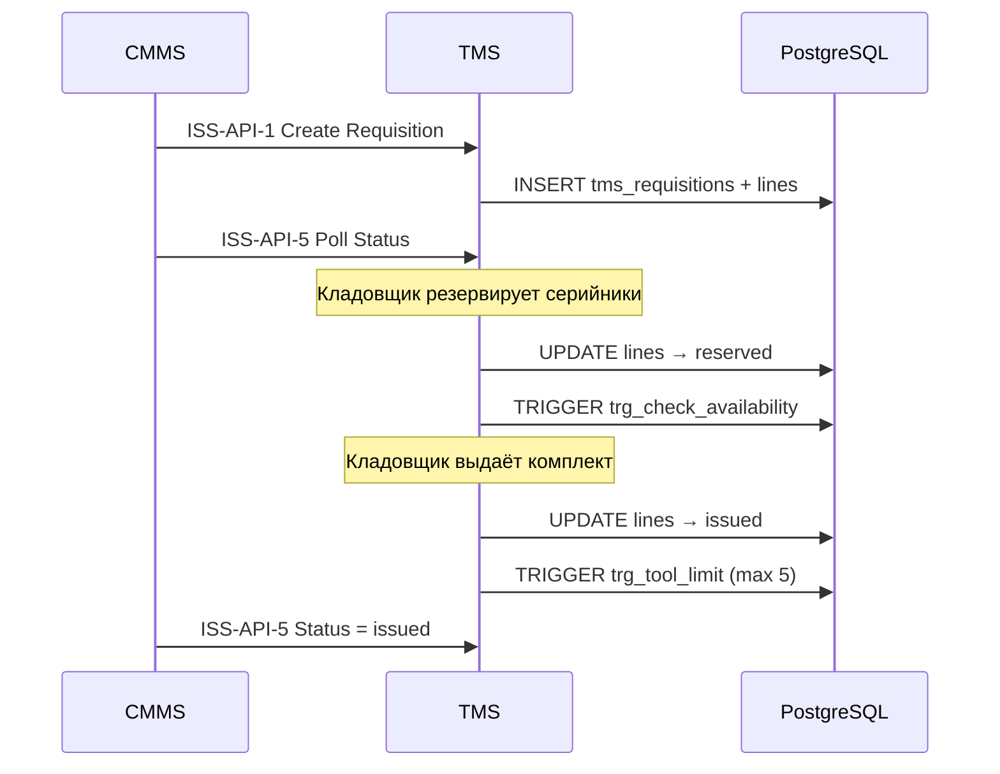

# Интеграция с CMMS

АИС TMS взаимодействует с системой CMMS (Computerized Maintenance Management System) по двум контурам.

## Контур Б — ISS-API (CMMS → TMS)

**Направление:** CMMS инициирует запросы к TMS.

**Назначение:** создание заявок на инструмент, получение номенклатуры складов, опрос статусов, отмена заявок.

**Базовый префикс:** `POST/GET /api/v1/integration/cmms/...`

### Эндпоинты

| ID | Метод | Путь | Описание | Статус |
|----|-------|------|----------|--------|
| ISS-API-1 | POST | `/cmms/tool-requisitions` | Создание заявки на выдачу (идемпотентно по `client_reference_id`) | Заготовка (501) |
| ISS-API-2 | POST | `/cmms/cancel-tool-requisitions` | Batch-отмена по `cmms_request_id` или `requisition_ids` | Заготовка (501) |
| ISS-API-3 | GET | `/cmms/warehouses` | Список складов для формы CMMS | Заготовка (501) |
| ISS-API-4 | GET | `/cmms/warehouse-catalog` | Номенклатура склада (`warehouse_id`, `availability`) | Заготовка (501) |
| ISS-API-5 | GET | `/cmms/tool-requisition` | Статус заявки (`requisition_id` / `cmms_request_id` / `cmms_schedule_id`) | Заготовка (501) |

### Поток выдачи (целевой)



### Связь с таблицами

- `tms_requisitions.external_order_id` — UUID заказа/наряда CMMS.
- `tms_requisitions.client_reference_id` — уникальный ключ идемпотентности.
- `tms_requisition_lines.catalog_item_id` → `tms_tool_types.id`.
- `tms_requisition_lines.tool_id` — привязка конкретного экземпляра при резерве.

### UI кладовщика

Страница `/requisitions` отображает:

- **CMMS-заявки** — `external_order_id IS NOT NULL`
- **Внутренние заявки** — `external_order_id IS NULL`

Операции: резерв → выдача → возврат с фиксацией `condition_on_return`.

## Контур А — REP-EVT-1 (CMMS → TMS, webhook)

**Направление:** CMMS отправляет событие при изменении статуса заявки на ремонт.

| ID | Метод | Путь | Описание | Статус |
|----|-------|------|----------|--------|
| REP-EVT-1 | POST | `/cmms/repair-request-status` | Webhook: `new_status` ∈ {closed, rejected, cancelled} → разблокировка инструмента | Заготовка (501) |

**Целевая логика:** при терминальном статусе ремонта инструмент переводится из `maintenance` в `available` (или по бизнес-правилам предприятия).

## Аутентификация интеграции

Реализовано в `verify_integration_auth()` (`integration.py`):

| Заголовок | Значение |
|-----------|----------|
| `Authorization` | `Bearer <TMS_INTEGRATION_SECRET>` |
| `apikey` | Supabase service role key |

Если `TMS_INTEGRATION_SECRET` пуст в `.env`, проверка отключена (только для локальной разработки).

## Переменные окружения

```env
TMS_INTEGRATION_SECRET=your-shared-secret-with-cmms
SUPABASE_KEY=service-role-key-used-as-apikey
```

## Внутренний контур (без CMMS)

Кладовщик может выдавать инструмент напрямую через:

- `POST /api/v1/tools/internal/issue`
- `POST /api/v1/tools/internal/return`

Создаётся заявка без `external_order_id` — отображается во вкладке «Внутренние» на `/requisitions`.

## Версионирование контракта

Модели запросов/ответов CMMS описаны в `app/models/schemas.py` (блок Integration). Поле `schema_version` зарезервировано для эволюции API.

## Дальнейшая реализация

Для production необходимо:

1. Реализовать ISS-API-1…5 с записью в Supabase.
2. Реализовать REP-EVT-1 с обновлением `tms_tools.status`.
3. Включить обязательный `TMS_INTEGRATION_SECRET`.
4. Настроить IP-allowlist или mTLS на уровне reverse proxy.
