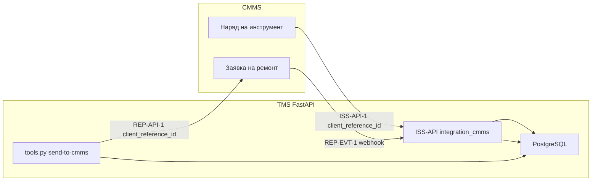

# Техническое описание интеграции BAAZ TMS с системой CMMS

## 1. Общие сведения

Интеграция реализует двусторонний обмен данными между BAAZ Tool Tracker и системой CMMS. Обмен разделён на два независимых контура:

| Контур | Направление | Предмет обмена |
|--------|-------------|----------------|
| Контур А — Repair | TMS → CMMS и CMMS → TMS | Заявки на ремонт и обслуживание инструмента |
| Контур Б — Requisition | CMMS → TMS | Заявки на получение инструмента со склада |

Базовый URL входящих вызовов CMMS в TMS:

```
http://<host>:8000/api/v1/integration/cmms
```

Реализация: app/api/endpoints/integration_cmms.py, app/services/cmms_integration_service.py, app/integration/cmms_client.py.

---

## 2. Аутентификация интеграции

### 2.1. CMMS → TMS

| Параметр | Значение |
|----------|----------|
| Заголовок | Authorization: Bearer |
| Секрет | TMS_INTEGRATION_SECRET из .env |
| Проверка | verify_cmms_integration_auth |

При пустом TMS_INTEGRATION_SECRET в среде разработки проверка Bearer отключена.

### 2.2. TMS → CMMS

| Параметр | Значение |
|----------|----------|
| Заголовок | Authorization: Bearer |
| Секрет | CMMS_INTEGRATION_SECRET |
| URL функций | CMMS_FUNCTIONS_URL |

Для чтения представлений integration.v_* используется publishable key CMMS в переменной CMMS_SUPABASE_KEY.

---

## 3. Контур Б — Requisition

### 3.1. Назначение

Контур обеспечивает создание заявки на инструмент в TMS по инициативе диспетчера или техника CMMS, последующую обработку кладовщиком и синхронизацию статусов.

### 3.2. Операции ISS-API

| ID | Метод | Путь | Назначение |
|----|-------|------|------------|
| ISS-API-1 | POST | /tool-requisitions | Создание заявки |
| ISS-API-2 | POST | /cancel-tool-requisitions | Отмена заявок |
| ISS-API-3 | GET | /warehouses | Список складов |
| ISS-API-4 | GET | /warehouse-catalog | Каталог типов на складе |
| ISS-API-5 | GET | /tool-requisition | Статус заявки |

### 3.3. Формат ISS-API-1 — создание заявки

**Тело запроса CreateToolRequisitionRequest**

| Поле | Тип | Обязательность | Описание |
|------|-----|----------------|----------|
| schema_version | string | Да | Версия контракта |
| client_reference_id | UUID | Да | Ключ идемпотентности |
| warehouse_id | UUID | Да | Склад TMS |
| work_order | object | Да | Снимок наряда CMMS |
| technician | object | Да | Данные техника |
| lines | array | Да | Строки заявки, минимум одна |
| notes | string | Нет | Примечание |

**Объект work_order**

| Поле | Тип | Описание |
|------|-----|----------|
| kind | enum request или schedule | Тип наряда |
| id | UUID | Идентификатор наряда CMMS |
| number | string | Номер наряда |
| status | string | Статус in_progress или scheduled |
| title | string | Заголовок |
| asset_name | string | Наименование оборудования |
| location_name | string | Место работ |

**Элемент массива lines**

| Поле | Тип | Описание |
|------|-----|----------|
| line_client_id | UUID | Внешний идентификатор строки |
| kind | enum catalog или free_text | Тип строки |
| catalog_item_id | UUID | Ссылка на tool_types для catalog |
| description | string | Текст для free_text |
| quantity | integer | Количество, минимум 1 |

**Ответ CreateToolRequisitionResponse — HTTP 201**

| Поле | Тип | Описание |
|------|-----|----------|
| requisition_id | UUID | Идентификатор заявки TMS |
| client_reference_id | UUID | Эхо ключа идемпотентности |
| warehouse_id | UUID | Склад |
| warehouse_name | string | Наименование склада |
| status | string | Статус new |
| created_at | datetime | Время создания |
| lines | array | Созданные строки с line_id |

### 3.4. Запись в базу данных при ISS-API-1

| Таблица | Действие |
|---------|----------|
| requisitions | INSERT с client_reference_id, warehouse_id, external_order_id |
| cmms_work_order_links | INSERT связи с cmms_work_order_id |
| requisition_lines | INSERT строк с line_client_id и status pending |

### 3.5. Идемпотентность client_reference_id в контуре Requisition

Поле client_reference_id в таблице requisitions имеет ограничение UNIQUE NOT NULL.

**Алгоритм ISS-API-1:**

1. Выполняется SELECT requisitions WHERE client_reference_id = payload.client_reference_id.
2. Если запись найдена — возвращается существующий CreateToolRequisitionResponse без повторного INSERT.
3. Если запись не найдена — выполняется создание requisitions, cmms_work_order_links и requisition_lines.

**Назначение:** повторный POST от CMMS при сетевом сбое не создаёт дубликат заявки. CMMS генерирует client_reference_id один раз и сохраняет его для повторных попыток.

**Связанные идентификаторы:**

| Идентификатор | Источник | Назначение |
|---------------|----------|------------|
| client_reference_id | CMMS | Ключ идемпотентности заявки |
| requisition_id | TMS | Внутренний первичный ключ |
| external_order_id | CMMS work_order.id | Поиск по наряду |
| line_client_id | CMMS | Идентификатор строки в CMMS |

### 3.6. Жизненный цикл заявки Requisition

| Этап | Исполнитель | Изменение в TMS |
|------|-------------|-----------------|
| Создание | CMMS ISS-API-1 | requisitions.status = new |
| Резервирование | Кладовщик | requisition_lines.status = reserved, триггер trg_check_availability |
| Выдача | Кладовщик | requisition_lines.status = issued, tools.status = in_use |
| Возврат | Кладовщик | requisition_lines.status = returned, tools.status = available или maintenance |
| Отмена | CMMS ISS-API-2 или кладовщик | requisitions.cancelled_at, status = cancelled |

Статус заголовка заявки вычисляется функцией derive_requisition_status по совокупности статусов строк.

---

## 4. Контур А — Repair

### 4.1. Назначение

Контур обеспечивает отправку экземпляра инструмента в ТОиР, отслеживание заявки на ремонт в CMMS и возврат инструмента на склад после завершения работ.

### 4.2. Исходящие операции TMS → CMMS

| ID | Метод | URL | Назначение |
|----|-------|-----|------------|
| REP-API-1 | POST | /functions/v1/integration-tms-create-request | Создание заявки на ремонт |
| REP-API-2 | POST | /functions/v1/integration-tms-inventory-received | Подтверждение передачи в отдел |
| REP-API-3 | GET | /rest/v1/v_inventory_requests | Чтение заявки |
| REP-API-4 | GET | /rest/v1/v_inventory_work_reports | Отчёты о работах |
| REP-API-5 | GET | /rest/v1/v_repair_departments | Список ремонтных отделов |

Точка входа UI и API TMS: POST /api/v1/tools/{tool_id}/send-to-cmms

### 4.3. Формат REP-API-1

**Тело запроса RepairRequestCreate**

| Поле | Тип | Обязательность | Описание |
|------|-----|----------------|----------|
| schema_version | string | Да | Версия контракта |
| client_reference_id | UUID | Да | Ключ идемпотентности |
| tool_id | UUID | Да | Идентификатор экземпляра TMS |
| tool_name | string | Да | Наименование для CMMS |
| tool_serial | string | Нет | Серийный номер |
| tool_type_name | string | Нет | Тип инструмента |
| request_type | enum | Да | Тип заявки: inspection, repair и др. |
| title | string | Да | Заголовок заявки |
| description | string | Нет | Описание неисправности |
| target_repair_department_id | UUID | Да | Целевой ремонтный отдел |
| inventory_handoff_mode | enum | Да | pickup_at_warehouse или deliver_to_department |
| inventory_warehouse_name | string | Нет | Наименование склада |

**Ответ RepairRequestResponse**

| Поле | Тип | Описание |
|------|-----|----------|
| request_id | UUID | Идентификатор заявки CMMS |
| request_number | string | Номер заявки |
| status | string | Начальный статус new |
| created_at | datetime | Время создания |

### 4.4. Запись в базу данных при отправке в ТОиР

| Таблица | Действие |
|---------|----------|
| tools | UPDATE status = pending_repair |
| cmms_repair_links | INSERT tool_id, cmms_request_id, client_reference_id, handoff_mode |

Ограничение UNIQUE на tool_id в cmms_repair_links запрещает более одной открытой заявки на ремонт для одного экземпляра.

### 4.5. Идемпотентность client_reference_id в контуре Repair

При вызове send-to-cmms сервер генерирует новый UUID client_reference_id и передаёт его в REP-API-1. Значение сохраняется в cmms_repair_links.client_reference_id с ограничением UNIQUE.

CMMS использует client_reference_id для предотвращения дублирования заявок при повторной отправке HTTP-запроса. Повтор POST с тем же client_reference_id должен вернуть ранее созданную заявку, а не создавать новую.

### 4.6. Входящий webhook REP-EVT-1

| Параметр | Значение |
|----------|----------|
| Метод | POST |
| Путь | /api/v1/integration/cmms/repair-request-status |
| Тело | RepairRequestStatusWebhook |

**Ключевые поля webhook**

| Поле | Тип | Описание |
|------|-----|----------|
| request_id | UUID | Идентификатор заявки CMMS |
| previous_status | string | Предыдущий статус |
| new_status | string | Новый статус |
| inventory_id | UUID | Идентификатор инструмента TMS |

**Логика обработки в repair_request_status_webhook**

| new_status | Действие над tools.status |
|------------|---------------------------|
| in_progress | pending_repair → maintenance |
| closed, rejected, cancelled при previous new или accepted | → available |
| closed, rejected, cancelled при ином previous | → pending_return |

Дополнительные операции кладовщика:

| API TMS | Условие | Результат |
|---------|---------|-----------|
| POST /tools/{id}/handover-to-repair | handoff_mode = deliver_to_department | REP-API-2, handoff_status = completed |
| POST /tools/{id}/accept-return-from-repair | status = pending_return | status = available |

### 4.7. Согласованность статусов Repair

| Этап | tools.status TMS | status CMMS |
|------|------------------|-------------|
| Отправка в ТОиР | pending_repair | new |
| Принятие отделом | pending_repair | accepted |
| Получение в ТОиР | maintenance | in_progress |
| Закрытие работ | pending_return | closed |
| Приёмка на склад | available | — |

---

## 5. Режимы интеграции

| Режим | Переменная | Поведение |
|-------|------------|-----------|
| Mock | CMMS_INTEGRATION_MODE=mock | MockCmmsRepairClient, фикстуры JSON |
| Live | CMMS_INTEGRATION_MODE=live | HTTP к Supabase и Edge Functions CMMS |

Фикстуры TMS: app/integration/fixtures/

---

## 6. Формат обмена данными

### 6.1. Транспорт

| Параметр | Значение |
|----------|----------|
| Протокол | HTTP/1.1 |
| Кодировка | UTF-8 |
| Формат тела | application/json |
| UUID | Строка в каноническом формате |
| datetime | ISO 8601 |

### 6.2. Версионирование контракта

Модели CreateToolRequisitionRequest, RepairRequestCreate и ответы наследуют IntegrationSchemaVersion с полем schema_version. Стороны фиксируют версию для совместимости при эволюции API.

### 6.3. Обработка ошибок

| Код HTTP | Ситуация |
|----------|----------|
| 400 | Ошибка валидации или срабатывание триггера PostgreSQL |
| 401 | Отсутствует Bearer при включённом секрете |
| 403 | Неверный секрет интеграции |
| 409 | Нарушение UNIQUE или FOREIGN KEY |
| 503 | CMMS недоступен в режиме Live |

---

## 7. Сводная таблица идемпотентности

| Контур | Поле | Таблица TMS | UNIQUE | Повторный запрос |
|--------|------|-------------|--------|------------------|
| Requisition | client_reference_id | requisitions | Да | Возврат существующей заявки ISS-API-1 |
| Repair | client_reference_id | cmms_repair_links | Да | CMMS возвращает существующую заявку REP-API-1 |
| Requisition | line_client_id | requisition_lines | Нет | Идентификация строки в CMMS |
| Repair | cmms_request_id | cmms_repair_links | Нет | Связь webhook REP-EVT-1 с tool_id |

---

## 8. Диаграмма контуров интеграции


